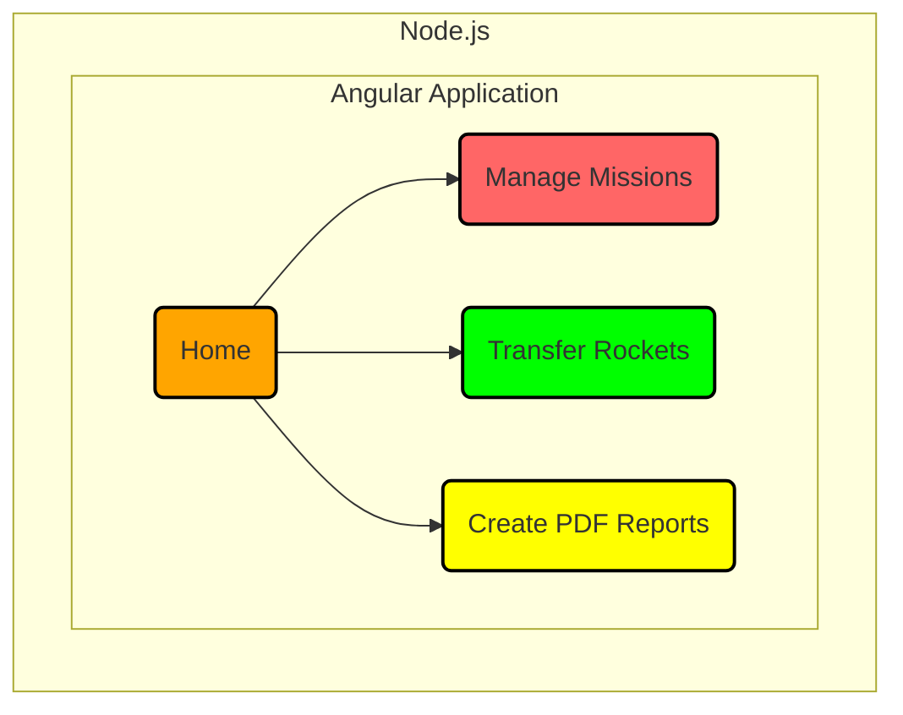
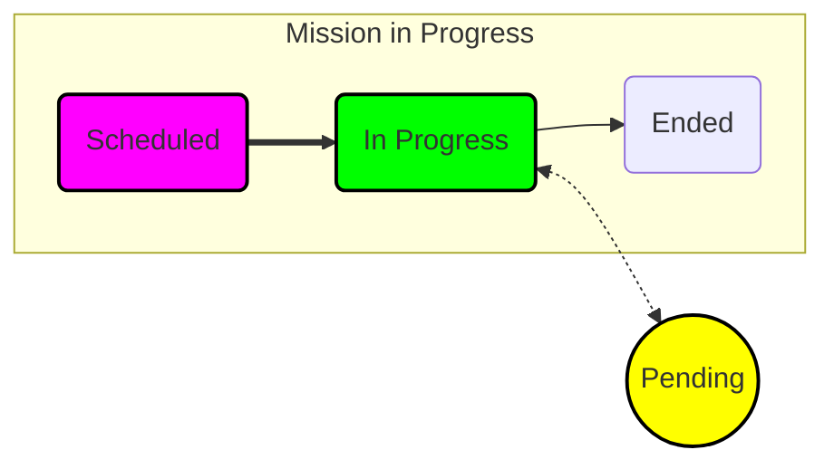
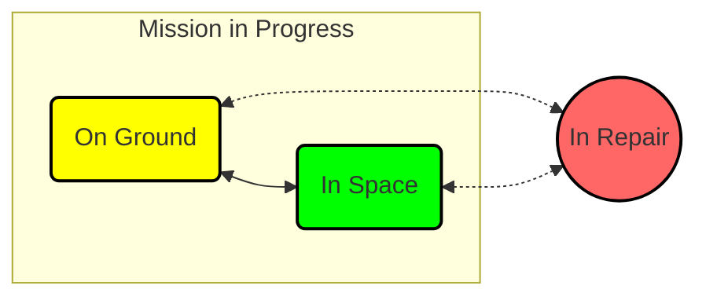

# The Recruitment Task S2

```geojson
{
  "type": "FeatureCollection",
  "features": [
    {
      "type": "Feature",
      "id": 1,
      "properties": {
        "ID": 0
      },
      "geometry": {
        "type": "Polygon",
        "coordinates": [
          [
            [20.80, 52.20],
            [20.80, 52.30],
            [21.20, 52.30],
            [21.20, 52.20]
          ]
        ]
      }
    }
  ]
}
```

``geojson
{
  "type": "FeatureCollection",
  "features": [
    {
      "type": "Feature",
      "geometry": {
        "type": "MultiLineString",
        "coordinates": [
          [
            [20.70, 52.20], [21.00, 52.25]
          ],
          [
            [21.00, 52.25], [21.00, 52.30]
          ],
          [
            [21.00, 52.30], [21.20, 52.30]
          ]
        ]
      }
    }
  ]
}
``


Angular 20 + Angular Material application using an in-memory store.

<table>
  <tr>
    <td rowspan="3"></td>
    <td></td>
    <td rowspan="3"></td>
  </tr>
  <tr>
    <td>
      Live demo&nbsp;&nbsp;➔&nbsp;&nbsp;
      <a href="https://ee-cs.github.io/RecruitmentTaskS2/">Recruitment Task S2 (GitHub Pages)</a>
    </td>
  </tr>
  <tr>
    <td></td>
  </tr>
</table>

---

## Business Logic

```mermaid
flowchart LR
  HOME(Home):::orangeBox
  MNG_MIS(Manage Missions):::redBox
  TRA_ROC(Transfer Rockets):::greenBox
  PDF(Create PDF Reports):::yellowBox
%% Flows
  subgraph Node.js
    subgraph "Angular Application"
      HOME --> MNG_MIS
      HOME --> TRA_ROC
      HOME --> PDF
    end
  end
%% Style Definitions
  classDef redBox fill: #ff6666, stroke: #000, stroke-width: 2px
  classDef greenBox fill: #00ff00, stroke: #000, stroke-width: 2px
  classDef yellowBox fill: #ffff00, stroke: #000, stroke-width: 2px
  classDef orangeBox  fill: #ffa500,stroke: #000, stroke-width:2px
```

## Mission Statuses

```mermaid
flowchart LR
SCD(Scheduled):::magentaBox
PND((Pending)):::yellowBox
PRG(In Progress):::greenBox
END(Ended):::cyanBox

subgraph "Mission in Progress"
  SCD ==> PRG --> END
end
PRG <.-> PND

%% Style Definitions
  classDef redBox fill: #ff6666, stroke: #000, stroke-width: 2px
  classDef greenBox fill: #00ff00, stroke: #000, stroke-width: 2px
  classDef magentaBox fill: #ff00ff, stroke: #000, stroke-width: 2px
  classDef yellowBox fill: #ffff00, stroke: #000, stroke-width: 2px
```

## Rocket Statuses

```mermaid
flowchart LR
%% 
GND(On Ground):::yellowBox
SPC(In Space):::greenBox
REP((In Repair)):::redBox

subgraph "Mission in Progress"
  GND <--> SPC
end
GND <.-> REP
SPC <.-> REP

%% Style Definitions
  classDef redBox fill: #ff6666, stroke: #000, stroke-width: 2px
  classDef greenBox fill: #00ff00, stroke: #000, stroke-width: 2px
  classDef yellowBox fill: #ffff00, stroke: #000, stroke-width: 2px
```
---

<details>
<summary><mark>Mission object JSON</mark></summary>

```json
{
  "missions": [
    {
      "id": 1,
      "name": "Moon",
      "missionStatus": "InProgress",
      "rockets": [
        {
          "id": 1,
          "name": "Apollo",
          "rocketStatus": "OnGround"
        }
      ]
    }
  ]
}
```

</details>

## Description of the business logic
1. When the "Home" page is selected:
  - The chosen data set is loaded.
  - Four data sets are available:
    - Standard
      - Data set described in the business requirements.
    - Large Scale
      - 182 missions.
      - Each mission contains 182 rockets.
      - Total number of rockets: 33,124.
      - Generated report spans approximately 850 pages.
    - Long Names
      - Single mission with a long name.
      - A single rocket with a long name is assigned to this mission.
      - Names may be up to 300 characters.
    - Empty
      - No missions and no rockets.
  - The selected data set is saved to local storage.
  - The previously saved data set is overwritten.

2. When the "Manage Missions" page is selected:
  - Create, read, update, and delete operations for missions.
  - For each mission: create, read, update, and delete operations for rockets.
  - Implemented features:
    - Changing mission and rocket statuses.
    - Pagination with options for 5, 10, 20, 50, 100, or 200 records per page.
    - Default pagination: 5 records per page.
    - Sorting by name or status.

3. When the "Transfer Rockets" page is selected:
  - The right pane shows unassigned rockets (the rocket pool).
  - The left pane shows rockets of the selected mission that are not in space.
  - Create an unassigned rocket with status "On Ground".
  - Add that unassigned rocket to the rocket pool.
  - Assign rockets from the rocket pool to the selected mission.
  - Unassign rockets from the selected mission and transfer them to the rocket pool.

4. When the "Create PDF Reports" page is selected:
  - The application generates a PDF report.
  - The generated file can be opened, downloaded, or printed.
  - The "Missions and Rockets Report" provides a summary of missions.
  - Missions in the report are sorted by the number of rockets assigned.
  - Each mission entry shows the mission status and all rockets assigned to that mission.

---

## Testing
- Unit tests for components and services.
- End-to-end (integration) tests using Cypress.
- Live demo with multiple data sets.

---

## Development
<details>
<summary>Proposed validation logic to implement</summary>

- Before setting a rocket status to "In Space", ensure that the mission is not "Scheduled".
- Before setting a rocket status to "In Repair", ensure that the mission is "Pending".
- Before changing a mission status from "Pending" to another status, ensure no rocket in the mission has status "In Repair".
- Before changing a mission status to "In Progress", ensure no rocket in the mission has status "In Repair".
- Before changing a mission status to "Ended", ensure no rocket in the mission has status "In Space".
- Rockets must not be assigned to missions with status "Ended"; rockets may only be unassigned from such missions.

</details>

<details>
<summary>Managing unassigned rockets in rocket pool</summary>

| Action | Expected | Actual  |
|--------|----------|---------|
| create | ✅ Yes   | ✅ Yes |
| update | ✅ Yes   | ❌ No  |
| read   | ✅ Yes   | ✅ Yes |
| delete | ✅ Yes   | ❌ No  |
</details>


<details>
<summary>Proposed enhancements</summary>

Add authorization and authentication.\
Add a blockchain for missions and rockets management.\
Add a business process model and a decision model for missions and rockets workflow.
</details>

<details>
<summary>Mission object definition</summary>

- [x] id
- [x] name
- [ ] description
- [x] assigned rockets
- [ ] creation date
- [ ] created by user
- [ ] updating date
- [ ] updated by user
- [ ] assign date
- [ ] assigned by user
- [ ] unassign date
- [ ] unassigned by user
- [ ] delete date
- [ ] deleted by user
</details>

<details>
<summary>Learning GitHub Flavored Markdown</summary>

0️⃣1️⃣2️⃣3️⃣4️⃣5️⃣6️⃣7️⃣8️⃣9️⃣🔟


</details>


