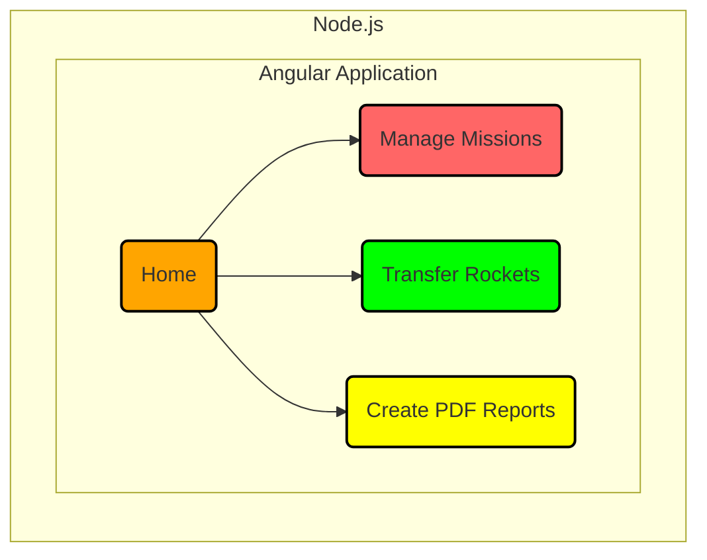
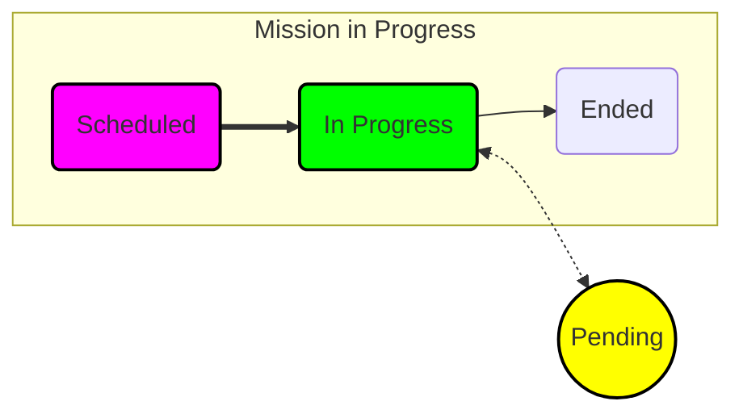
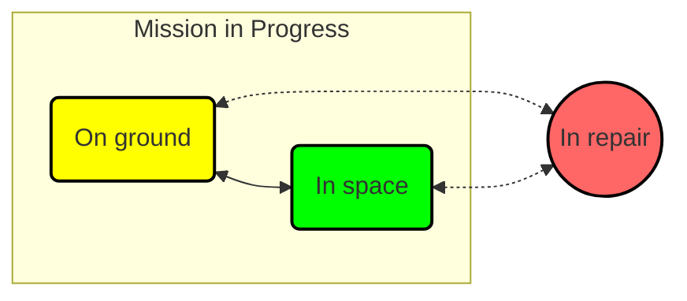

# The Recruitment Task S2

Angular 20 Material application using an in-memory store.

Live Angular application demo  ➔   
  [Recruitment Task S2 (GitHub Pages)](https://Ee-Cs.github.io/RecruitmentTaskS2/home)

## Business Logic

```mermaid
flowchart LR
  HOME(Home):::orangeBox
  MNG_MIS(Manage Missions):::redBox
  TRA_ROC(Transfer Rockets):::greenBox
  PDF(Create PDF Reports):::yellowBox
%% Flows
  subgraph Node.js
    subgraph "Angular Application"
      HOME --> MNG_MIS
      HOME --> TRA_ROC
      HOME --> PDF
    end
  end
%% Style Definitions
  classDef redBox fill: #ff6666, stroke: #000, stroke-width: 2px
  classDef greenBox fill: #00ff00, stroke: #000, stroke-width: 2px
  classDef yellowBox fill: #ffff00, stroke: #000, stroke-width: 2px
  classDef orangeBox  fill: #ffa500,stroke: #000, stroke-width:2px
```

## Mission Statuses

```mermaid
flowchart LR
SCD(Scheduled):::magentaBox
PND((Pending)):::yellowBox
PRG(In Progress):::greenBox
END(Ended):::cyanBox

subgraph "Mission in Progress"
  SCD ==> PRG --> END
end
PRG <.-> PND

%% Style Definitions
  classDef redBox fill: #ff6666, stroke: #000, stroke-width: 2px
  classDef greenBox fill: #00ff00, stroke: #000, stroke-width: 2px
  classDef magentaBox fill: #ff00ff, stroke: #000, stroke-width: 2px
  classDef yellowBox fill: #ffff00, stroke: #000, stroke-width: 2px
```

## Rocket Statuses

```mermaid
flowchart LR
%% 
GND(On ground):::yellowBox
SPC(In space):::greenBox
REP((In repair)):::redBox

subgraph "Mission in Progress"
  GND <--> SPC
end
GND <.-> REP
SPC <.-> REP

%% Style Definitions
  classDef redBox fill: #ff6666, stroke: #000, stroke-width: 2px
  classDef greenBox fill: #00ff00, stroke: #000, stroke-width: 2px
  classDef yellowBox fill: #ffff00, stroke: #000, stroke-width: 2px
```

## The description of the business logic
- On page selected with menu **"Home"**
  - loading the selected data sets
  - available are three data sets:
    - **Standard**
      - data set described in business requirements
    - **Big**
      - 182 missions
      - each mission has 182 rockets
      - total number of rockets is 33 124
      - created report has 850 pages
    - **Long Names**
      - single mission with long name
      - to this mission is assigned single rocket with long name
      - name up to three hundred characters
    - **Empty**
      - no missions and no rockets
  - selected data set is loaded into the local storage
  - the previous data set is overwritten

- On page selected with menu **"Manage Missions"**
  - creating, reading, updating, and deleting the missions
  - for each mission - creating, reading, updating, and deleting the rockets
  - implemented are following functionalities
    -  changing the mission status and the rocket status
    - the pagination with 5, 10, 20, 50, 100 or 200 records per page
    - default pagination setting is 5 records per page
    - sorting by name or by status.
- On page selected with menu **"Transfer Rockets"**
  - on the right side are presented rockets in the rocket pool
  - on the left side are presented rockets of the selected mission which are not in space
  - creating an unassigned rocket with status "On Ground"
  - this unassigned rocket is added to the rocket pool
  - taking the rockets from the rocket pool and assigning them to the single mission
  - unassigning the rockets from the selected mission and transfering them to the rocket pool
- On page selected with menu **"Create PDF Reports"**
  - application creates the PDF report file 
  - it is possible to open, download, or print the created file
  - the summary of missions is in the "Missions and Rockets Report"
  - the missions presented in report are sorted by the number of rockets assigned
  - for every mission it is presented the mission status and all rockets assigned to this mission

## Implemented tests
- the unit tests for components and services
- the end-to-end tests (integration tests) with Cypress
- the application live demo with data sets

## 
The proposed validation logic to implement

- before setting rocket status to 'In space' assert that mission is not in status 'Scheduled' 
- before setting rocket status to 'In repair' assert that mission is in status 'Pending' 
- before changing mission status from 'Pending' to other assert that no rocket in mission is in status 'In repair'
- before changing mission status to 'In Progress' assert that no rocket in mission has status 'In repair'
- before changing mission status to 'Ended' assert that no rocket in mission has status 'In space'
- rockets should not be assigned to missions in status 'Ended', rockets could only be unassigned from that missions

