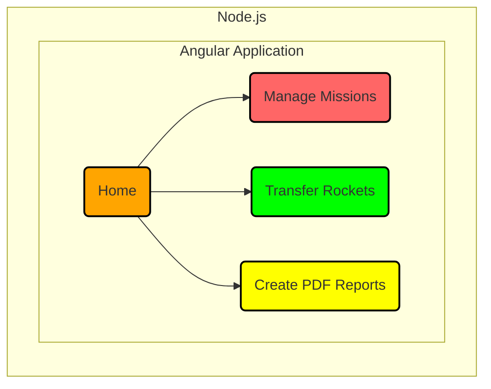
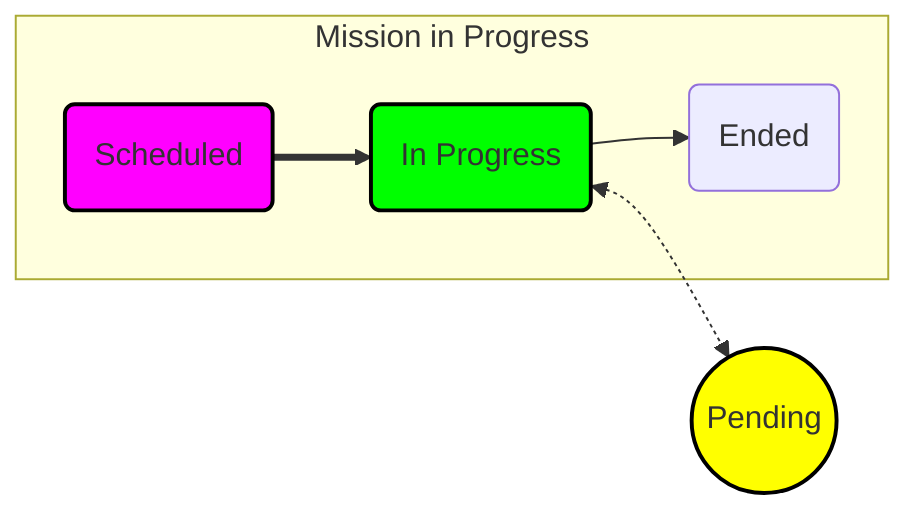
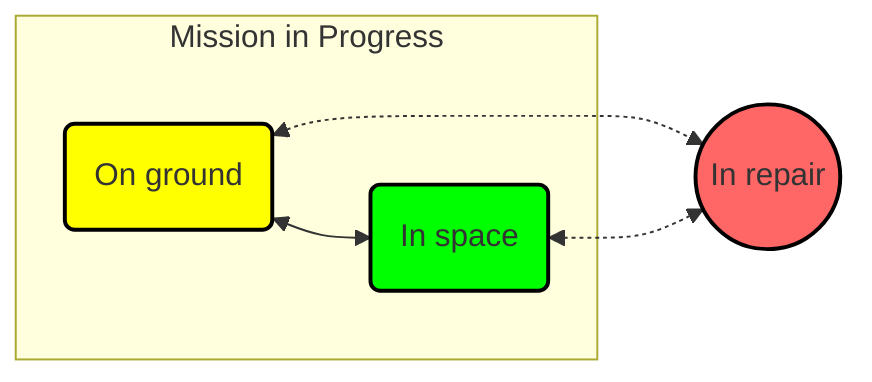

# The Recruitment Task S2

Angular 20 Material application using an in-memory store.

Live Angular application demo  ➔   
  [Recruitment Task S2 (GitHub Pages)](https://Ee-Cs.github.io/RecruitmentTaskS2/home)

## Business Logic

```mermaid
flowchart LR
  HOME(Home):::orangeBox
  MNG_MIS(Manage Missions):::redBox
  TRA_ROC(Transfer Rockets):::greenBox
  PDF(Create PDF Reports):::yellowBox
%% Flows
  subgraph Node.js
    subgraph "Angular Application"
      HOME --> MNG_MIS
      HOME --> TRA_ROC
      HOME --> PDF
    end
  end
%% Style Definitions
  classDef redBox fill: #ff6666, stroke: #000, stroke-width: 2px
  classDef greenBox fill: #00ff00, stroke: #000, stroke-width: 2px
  classDef yellowBox fill: #ffff00, stroke: #000, stroke-width: 2px
  classDef orangeBox  fill: #ffa500,stroke: #000, stroke-width:2px
```

## Mission Statuses

```mermaid
flowchart LR
SCD(Scheduled):::magentaBox
PND((Pending)):::yellowBox
PRG(In Progress):::greenBox
END(Ended):::cyanBox

subgraph "Mission in Progress"
  SCD ==> PRG --> END
end
PRG <.-> PND

%% Style Definitions
  classDef redBox fill: #ff6666, stroke: #000, stroke-width: 2px
  classDef greenBox fill: #00ff00, stroke: #000, stroke-width: 2px
  classDef magentaBox fill: #ff00ff, stroke: #000, stroke-width: 2px
  classDef yellowBox fill: #ffff00, stroke: #000, stroke-width: 2px
```

## Rocket Statuses

```mermaid
flowchart LR
%% 
GND(On ground):::yellowBox
SPC(In space):::greenBox
REP((In repair)):::redBox

subgraph "Mission in Progress"
  GND <--> SPC
end
GND <.-> REP
SPC <.-> REP

%% Style Definitions
  classDef redBox fill: #ff6666, stroke: #000, stroke-width: 2px
  classDef greenBox fill: #00ff00, stroke: #000, stroke-width: 2px
  classDef yellowBox fill: #ffff00, stroke: #000, stroke-width: 2px
```

## The description of the menu actions
- Home
  - Load selected data set.
  - Available are three data sets:
    - Standard (data set from business requirements)
    - Big (182 missions, each mission has 182 rockets, total number of rockets is 33 124, report has 850 pages).
    - Long Names (mission and rocket with long name, 300 characters).
    - Empty (no missions and no rockets)
  - Selected data set is loaded into the local storage (overwriting previous data set).

- Manage Missions
  - Create, read, update, and delete missions.
  - For each mission create, read, update, and delete rockets.
  - Implemented
    - Mission status and rocket status changing.
    - The pagination with 5, 10, 20, 50, 100 or 200 records per page.
      Default is 5 records per page.
    - sorting by name and status.
- Transfer Rockets
  - On the right side are presented rockets in the rocket pool.
  - On the left side are presented selected mission rockets which are not in space.
  - Create an unassigned rocket with status "On Ground" and add it to the rocket pool.
  - Take the rockets from the rocket pool and assign them to single mission.
  - Unassign the rockets from the selected mission and transfer them to the rocket pool.
- Create PDF Reports
  - Create PDF report file. Open, download, or print the created file.
  - In the "Missions and Rockets Report" is the summary of missions.
  - The  missions are sorted by the number of rockets assigned.
  - For every mission is presented the mission status and its rockets.

### The proposed validation logic to implement
- before setting rocket status to 'In space' assert that mission is not in status 'Scheduled' 
- before setting rocket status to 'In repair' assert that mission is in status 'Pending' 
- before changing mission status from 'Pending' to other assert that no rocket in mission is in status 'In repair'
- before changing mission status to 'In Progress' assert that no rocket in mission has status 'In repair'
- before changing mission status to 'Ended' assert that no rocket in mission has status 'In space'
- rockets should not be assigned to missions in status 'Ended', rockets could only be unassigned from that missions


Scenario:
- Running unit tests
- Running end-to-end tests (integration tests)
- Running application live demo


To download `SHASUMS256.txt` using `curl`:
```bash
curl -O https://nodejs.org/dist/vx.y.z/SHASUMS256.txt
```
OK **Antoine**

<details>
<summary>Description</summary>
The business requirements

The business logic
  <a href="https://github.com/Ee-Cs/questionnaire/blob/main/docs/mermaid/flowchart.md"><b>diagrams</b></a>.

The model
  <a href="https://github.com/Ee-Cs/questionnaire/blob/main/docs/mermaid/classDiagram.md"><b>class diagram</b></a>.  
</details>

# one # comment
## two
### three
#### four
##### five
