```mermaid
---
title: Model Class Diagram
---
classDiagram
class Mission {
  +number id
  +string name
  +MissionStatus missionStatus
  +Rocket[] rockets
}

class Rocket {
  +number id
  +number missionId
  +string name
  +RocketStatus rocketStatus
}

class MissionStatus {
  <<enumeration>>
  🟣 +Scheduled = "Scheduled"
  🟡 +Pending = "Pending"
  🟢 +InProgress = "In Progress"
  🟤 +Ended = "Ended"
}

class RocketStatus {
  <<enumeration>>
  🟨 +OnGround = "On Ground"
  🟩 +InSpace = "In Space"
  🟥 +InRepair = "In Repair"
}

Mission "1" o-- "*" Rocket : rockets
MissionStatus <|.. Mission : missionStatus
RocketStatus <|.. Rocket : rocketStatus
```

# The Recruitment Task S2
An Angular 20 + Angular Material application using an in-memory store.  

<table>
  <tr>
    <td rowspan="3"></td>
    <td></td>
    <td rowspan="3"></td>
  </tr>
  <tr>
    <td>
      Live demo&nbsp;&nbsp;➔&nbsp;&nbsp;
      <a href="https://ee-cs.github.io/RecruitmentTaskS2/">Recruitment Task S2 (GitHub Pages)</a>
    </td>
  </tr>
  <tr>
    <td></td>
  </tr>
</table>

## ❶ Architecture


---



---


---


---

<details>
<summary><mark>Mission object JSON</mark></summary>

```json
{
  "missions": [
    {
      "id": 1,
      "name": "Moon",
      "missionStatus": "InProgress",
      "rockets": [
        {
          "id": 1,
          "name": "Apollo",
          "rocketStatus": "OnGround"
        }
      ]
    }
  ]
}
```

</details>

## ❷ Description of the Business Logic
1. **When the "Home" page is selected:**
  - The chosen dataset is loaded.
  - Four datasets are available:
    - **Standard**
      - Dataset described in the business requirements.
      - Used in Cypress tests.
    - **Large Scale**
      - 182 missions.
      - Each mission contains 182 rockets.
      - Total number of rockets: 33,124.
    	- The generated report spans approximately 850 pages.
    - **Long Names**
    	- A single mission with a long name.
      - A single rocket with a long name is assigned to this mission.
      - Names may be up to 300 characters.
    - **Empty**
      - No missions and no rockets.
      - Used in Cypress tests.
  - The selected dataset is saved to local storage.
  - The previously saved dataset is overwritten.

2. **When the "Manage Missions" page is selected:**
  - Perform create, read, update, and delete operations for missions.
  - For each mission, perform create, read, update, and delete operations for rockets.
  - Implemented features:
    - Changing mission and rocket statuses.
    - Pagination with options for 5, 10, 20, 50, 100, or 200 records per page.
    - Default pagination: 5 records per page.
    - Sorting by name or status.
3. **When the "Transfer Rockets" page is selected:**
  - The right pane shows unassigned rockets (the rocket pool).
  - The left pane shows rockets of the selected mission that are not in space.
  - Create an unassigned rocket with the status "On Ground".
  - Add that unassigned rocket to the rocket pool.
  - Assign rockets from the rocket pool to the selected mission.
  - Unassign rockets from the selected mission and transfer them to the rocket pool.
4. **When the "Create PDF Reports" page is selected:**
  - The application generates a PDF report.
  - The generated file can be opened, downloaded, or printed.
  - The "Missions and Rockets Report" provides a summary of missions.
  - Missions in the report are sorted by the number of rockets assigned.
  - Each mission entry shows the mission status and all rockets assigned to that mission.

---

## ❸ Testing
 - 80 unit tests for components and services.
 - 6 end-to-end (integration) tests using Cypress.
 - 32 [screenshots](https://github.com/ee-cs/RecruitmentTaskS2/tree/main/cypress/screenshots) generated by Cypress.
- [Live demo](https://ee-cs.github.io/RecruitmentTaskS2/) with multiple datasets.

---

## ❹ Development
<details>
<summary>Proposed Validation Logic to Implement</summary>

- Before setting a rocket status to "In Space", ensure that the mission is not "Scheduled".
- Before setting a rocket status to "In Repair", ensure that the mission is "Pending".
- Before changing a mission status from "Pending" to another status, ensure no rocket in the mission has the status "In Repair".
- Before changing a mission status to "In Progress", ensure no rocket in the mission has the status "In Repair".
- Before changing a mission status to "Ended", ensure no rocket in the mission has the status "In Space".
- Rockets must not be assigned to missions with the status "Ended"; rockets may only be unassigned from such missions.

</details>

<details>
<summary>Managing Unassigned Rockets in the Rocket Pool</summary>

| Action | Expected | Actual  |
|--------|----------|---------|
| Create | ✅ Yes   | ✅ Yes |
| Update | ✅ Yes   | ❌ No  |
| Read   | ✅ Yes   | ✅ Yes |
| Delete | ✅ Yes   | ❌ No  |
</details>


<details>
<summary>Proposed Enhancements</summary>

Replace the in-memory store with an appropriate database.\
Refactor application logging. \
Add authorization and authentication. \
Add event auditing and error monitoring to maintain high-quality service. \
Add a business process model and a decision model for missions and rockets workflow. \
Add a blockchain for missions and rockets management. \
Switch to nanoservices on a cloud platform.
</details>

<details>
<summary>Mission Model Refinement</summary>

- [x] id
- [x] name
- [ ] description
- [x] assigned rockets
- [ ] creation date
- [ ] created by user
- [ ] updating date
- [ ] updated by user
- [ ] assign date
- [ ] assigned by user
- [ ] unassign date
- [ ] unassigned by user
- [ ] delete date
- [ ] deleted by user
</details>
