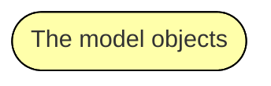
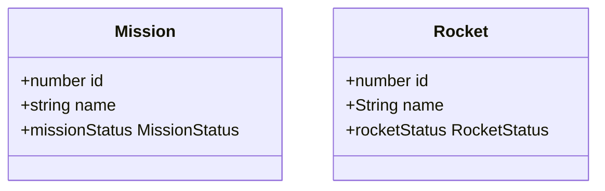

```mermaid
flowchart LR
box([The model objects]):::lightYellowBox
classDef lightYellowBox fill:#ffffaa,stroke:#000
```

```mermaid
classDiagram
class Mission {
 +number id
 +string name
 +missionStatus MissionStatus 
}

class Rocket {
 +number id
 +String name
 +rocketStatus RocketStatus 
}
 
```

##### Aggregate o-- Mission : mission
##### Aggregate o-- array : rockets
